```mermaid
graph TD
    A[中医智能辅助诊疗系统一级功能包] --> B(用户与权限管理)
    A --> C(病例与数据采集)
    A --> D(智能分析流水线)
    A --> E(结果展示与可解释输出)
    A --> F(医生审核与修订)
    A --> G(管理员治理与运维)
    A --> H(审计与日志追踪)

    B --> B1[登录认证]
    B --> B2[角色权限控制]
    B --> B3[基础用户信息管理]

    C --> C1[病例创建]
    C --> C2[舌象图像上传]
    C --> C3[问诊信息提交与管理]

    D --> D1[舌象特征提取]
    D --> D2[问诊语义解析]
    D --> D3[融合推理]
    D --> D4[解释生成]

    E --> E1[证候识别展示]
    E --> E2[诊疗建议展示]
    E --> E3[条目化依据说明查询]

    F --> F1[病例结果审核]
    F --> F2[通过/驳回/修订]
    F --> F3[审核意见留存]

    G --> G1[系统管理维护]
    G --> G2[健康检查]
    G --> G3[数据治理项维护]

    H --> H1[关键操作留痕]
    H --> H2[访问日志查询]
    H --> H3[审计查询及追溯定位]

    classDef default fill:#f9f9f9,stroke:#333,stroke-width:1px;
    classDef root fill:#e1f5fe,stroke:#0288d1,stroke-width:2px,font-weight:bold;
    classDef package fill:#fff3e0,stroke:#f57c00,stroke-width:1.5px;
    class A root;
    class B,C,D,E,F,G,H package;
```

```
%%{init:{
  "theme":"base",
  "flowchart":{"curve":"basis","nodeSpacing":28,"rankSpacing":40},
  "themeVariables":{
    "fontFamily":"SimSun, Songti SC, Arial",
    "fontSize":"16px",
    "primaryTextColor":"#111827",
    "lineColor":"#6B7280"
  }
}}%%

flowchart TD
  A["中医智能辅助诊疗系统<br/>一级功能包"]:::sys

  A --> B["用户与权限管理"]:::hubP
  A --> C["病例与数据采集"]:::hubD
  A --> D["智能分析流水线"]:::hubA
  A --> E["结果展示与可解释输出"]:::hubP
  A --> F["医生审核与修订"]:::hubD
  A --> G["管理员治理与运维"]:::hubA
  A --> H["审计与日志追踪"]:::hubP

  %% 用户与权限管理
  subgraph SB["用户与权限管理"]
    direction TB
    B1["登录认证"]:::item
    B2["角色权限控制"]:::item
    B3["基础用户信息管理"]:::item
  end
  B --> SB

  %% 病例与数据采集
  subgraph SC["病例与数据采集"]
    direction TB
    C1["病例创建"]:::item
    C2["舌象图像上传"]:::item
    C3["问诊信息提交与管理"]:::item
  end
  C --> SC

  %% 智能分析流水线
  subgraph SD["智能分析流水线"]
    direction TB
    D1["舌象特征提取"]:::item
    D2["问诊语义解析"]:::item
    D3["融合推理"]:::item
    D4["解释生成"]:::item
  end
  D --> SD

  %% 结果展示与可解释输出
  subgraph SE["结果展示与可解释输出"]
    direction TB
    E1["证候识别展示"]:::item
    E2["诊疗建议展示"]:::item
    E3["条目化依据说明查询"]:::item
  end
  E --> SE

  %% 医生审核与修订
  subgraph SF["医生审核与修订"]
    direction TB
    F1["病例结果审核"]:::item
    F2["通过 / 驳回 / 修订"]:::item
    F3["审核意见留存"]:::item
  end
  F --> SF

  %% 管理员治理与运维
  subgraph SG["管理员治理与运维"]
    direction TB
    G1["系统管理维护"]:::item
    G2["健康检查"]:::item
    G3["数据治理项维护"]:::item
  end
  G --> SG

  %% 审计与日志追踪
  subgraph SH["审计与日志追踪"]
    direction TB
    H1["关键操作留痕"]:::item
    H2["访问日志查询"]:::item
    H3["审计查询及追溯定位"]:::item
  end
  H --> SH

  %% 节点样式（沿用你那套）
  classDef sys fill:#111827,stroke:#111827,color:#FFFFFF,stroke-width:2px,font-weight:bold;
  classDef hubP fill:#E0F2FE,stroke:#0284C7,stroke-width:2px,font-weight:bold;
  classDef hubD fill:#ECFDF5,stroke:#16A34A,stroke-width:2px,font-weight:bold;
  classDef hubA fill:#FFF7ED,stroke:#EA580C,stroke-width:2px,font-weight:bold;
  classDef item fill:#FFFFFF,stroke:#D1D5DB,stroke-width:1px,rx:10,ry:10;

  %% 分组外框（同风格虚线框）
  style SB fill:#F0F9FF,stroke:#BAE6FD,stroke-width:2px,stroke-dasharray: 3 3,rx:14,ry:14
  style SC fill:#F0FDF4,stroke:#BBF7D0,stroke-width:2px,stroke-dasharray: 3 3,rx:14,ry:14
  style SD fill:#FFF7ED,stroke:#FED7AA,stroke-width:2px,stroke-dasharray: 3 3,rx:14,ry:14
  style SE fill:#F0F9FF,stroke:#BAE6FD,stroke-width:2px,stroke-dasharray: 3 3,rx:14,ry:14
  style SF fill:#F0FDF4,stroke:#BBF7D0,stroke-width:2px,stroke-dasharray: 3 3,rx:14,ry:14
  style SG fill:#FFF7ED,stroke:#FED7AA,stroke-width:2px,stroke-dasharray: 3 3,rx:14,ry:14
  style SH fill:#F0F9FF,stroke:#BAE6FD,stroke-width:2px,stroke-dasharray: 3 3,rx:14,ry:14
```