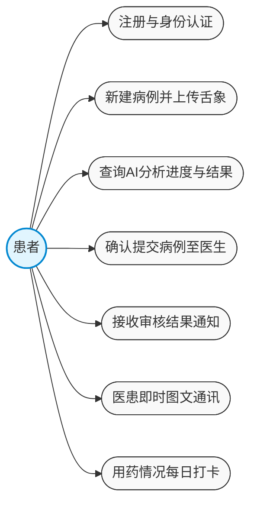
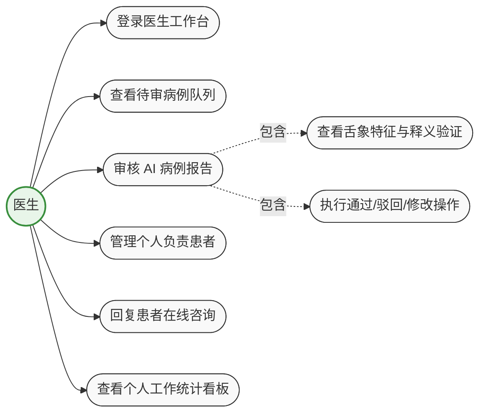
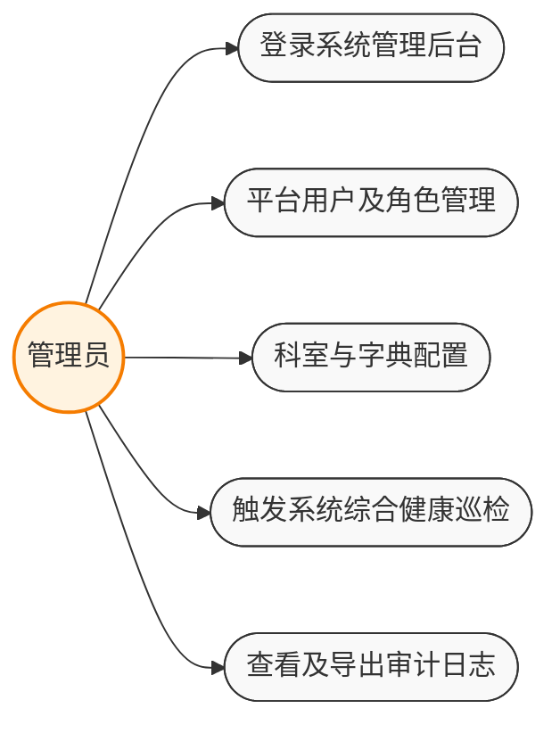

# 3.3 功能用例分析

系统根据用户角色划分，主要包括三类参与者：患者、医生、管理员。本节将按角色对系统功能模块进行详细的用例分析，明确各角色与系统之间的交互行为与边界。

## 3.3.1 患者端功能用例分析

患者端主要运行在微信小程序平台上，其核心功能围绕健康信息的上报、AI辅助诊断结果的查看以及后续的治疗随访。患者通过该端建立专属的病历档案并启动诊疗流水线。

**功能描述**：
患者打开小程序后可完成注册与身份认证。核心业务流程中，患者可以创建新病例，这包括选择就诊科室与主治医师、填写结构化的问诊问卷，并授权系统摄像头或相册上传舌象清晰照片。病例提交后触发云端AI流水线，患者可查询当前AI处理进度。分析完成后，患者先预览AI提取出的舌体特征及辨证参考，确认无误后点击正式提交给医生审核。此外，在日常居家康复阶段，患者可使用医患即时通讯模块与医生对话，并针对医生给定的中药处方进行每日的三餐“用药打卡”与疗效反馈。

**患者端用例图**：

**患者端核心用例说明**：

| 用例名称 | 新建病例并上传舌象 |
| :--- | :--- |
| **参与者** | 患者 |
| **前置条件** | 患者已成功登录微信小程序端 |
| **基本流程** | 1. 患者在系统首页点击“新建病例”按钮。 2. 系统呈现导诊页面，患者依次选择对应科室和期望的主诊医生。 3. 患者填写结构化问卷（包括主诉、饮食、睡眠、二便等中医问诊关键要素）。 4. 患者拍摄或上传本人当前舌象的高清图片。 5. 系统前端首先调用 YOLO 服务进行舌体快速验证，确认包含清晰有效舌体后允许提交。 6. 患者点击“开始 AI 分析”，系统后台生成病例记录并异步启动多模态推理流水线。 |

| 用例名称 | 确认提交病例至医生 |
| :--- | :--- |
| **参与者** | 患者 |
| **前置条件** | 后台AI流水线运行结束，病例状态变更为“诊断中(running)” |
| **基本流程** | 1. 患者进入病例详情页，系统展示由AI提取的舌色、舌苔、裂纹等特征以及大模型生成的辅助诊断解释。 2. 患者阅读AI给出的初步参考报告。 3. 患者认为信息采集完整无误后，点击“确认提交给医生审核”按钮。 4. 病例状态由“诊断中”自动流转为“待审核(pending_review)”，并向关联医生发送新待办通知。 |

---

## 3.3.2 医生端功能用例分析

医生端主要运行于桌面浏览器（Web端），致力于为专科中医师提供一个高效、直观的辅助阅片与临床决策工作台。

**功能描述**：
医生通过专属账号登录系统后，首先进入数据与工作看板，查看近期的审核通过率、高频证候分布统计等宏观数据。其核心工作是处理“待审核”队列中的患者病例。在病例详情页中，医生可全面掌握原始舌象图片、YOLO模型给出的病灶分割与热力图标注、症状语义解析结果以及大模型溯源给出的辨证依据。经综合裁量后，医生对该诊断报告执行“通过”、“驳回（附带补充说明）”或“人工修订并通过”的操作；确诊后系统自动派发基于该方剂属性的追踪随访计划。医生还可通过后台独立的聊天面板回复患者的在线咨询。

**医生端用例图**：

**医生端核心用例说明**：

| 用例名称 | 审核 AI 病例报告 |
| :--- | :--- |
| **参与者** | 医生 |
| **前置条件** | 患者已确认提交病例，且病例进入医生个人的“待审核”队列 |
| **基本流程** | 1. 医生从工作台点击进入具体的待审核病例详情。 2. 页面中栏展示原始舌象与AI分割渲染后的检测图框，右栏提供大模型输出的图谱溯源证据链（如：此证型由“舌质红+干咳”特征推理得出）。 3. 医生审查确认 AI 分析合理，可直接点击“审核通过”；若发现证候定性存在偏差，点击“修订”按钮修改系统推荐证型或增删处方药味，并在此后点击“修订通过”。 4. 审核完成产生最终效力，病例状态更新为“已通过”，流程闭环。 |

| 用例名称 | 查看个人工作统计看板 |
| :--- | :--- |
| **参与者** | 医生 |
| **前置条件** | 医生已正确登录Web端并拥有有效病例处理记录 |
| **基本流程** | 1. 医生在侧边栏点击进入“数据统计”模块。 2. 系统从后台汇集多维度聚合数据，并以可视化图表形式渲染。 3. 医生查阅近 7 日的接诊/审核处理走势图，以及个人所处理病例中“证候类别”的占比分布分析。 4. 辅助医生了解近期接诊病例的高发病机倾向。 |

---

## 3.3.3 管理员端功能用例分析

管理员端属于系统的最高权限管理区域（Web后台），主要负责系统整体的稳定性监控与内部规则治理，不对具体的诊断业务进行医学级别的干涉。

**功能描述**：
系统管理员登录后，主要承担三大块职责：账号维护、状态巡检与安全审计。管理员可管理全站的医生资质与注册名录，统筹调配科室与人员结构。为保障AI依赖环境的高可用性，管理员可通过前端直接触发后端的“系统健康巡检”，检测包括但不限于YOLO推理服务器通信状况、大模型API账户余额与连通性、数据库及缓存心跳等核心网元状态。此外，系统中所有关键事件（包括敏感登录、报告审批变更、AI流水线异常失败）均会被强制写入底层不可变审计日志表，管理员依法享有时序追溯权。

**管理员端用例图**：

**管理员端核心用例说明**：

| 用例名称 | 触发系统综合健康巡检 |
| :--- | :--- |
| **参与者** | 系统管理员 |
| **前置条件** | 管理员具有运维监控权限并处于登录状态 |
| **基本流程** | 1. 管理员导航至“系统健康”监控面板。 2. 单击“执行实例全身体检”按钮。 3. 后台服务异步向数据库服务器、Redis缓存、远端大语言模型API网关以及本地挂载的YOLO权重服务发起心跳探测。 4. 前端收到各项Ping值以及异常报错信息（包括模型加载状态），并将异常节点以高亮提示报警，以便运维介入。 |

| 用例名称 | 查看及导出审计日志 |
| :--- | :--- |
| **参与者** | 系统管理员 |
| **前置条件** | 具备管理员 `admin` 角色 |
| **基本流程** | 1. 管理员进入“操作审计”菜单页面。 2. 页面根据时间倒序呈现系统内所有核心行为轨迹（如：张医生修改了ID为xx的处方，李患者创建了新病例）。 3. 管理员通过日期区间、操作类型或用户ID进行组合查询，追溯特定异常流转节点。 4. 允许管理员将指定区间的原始日志导出存证备查。 |
