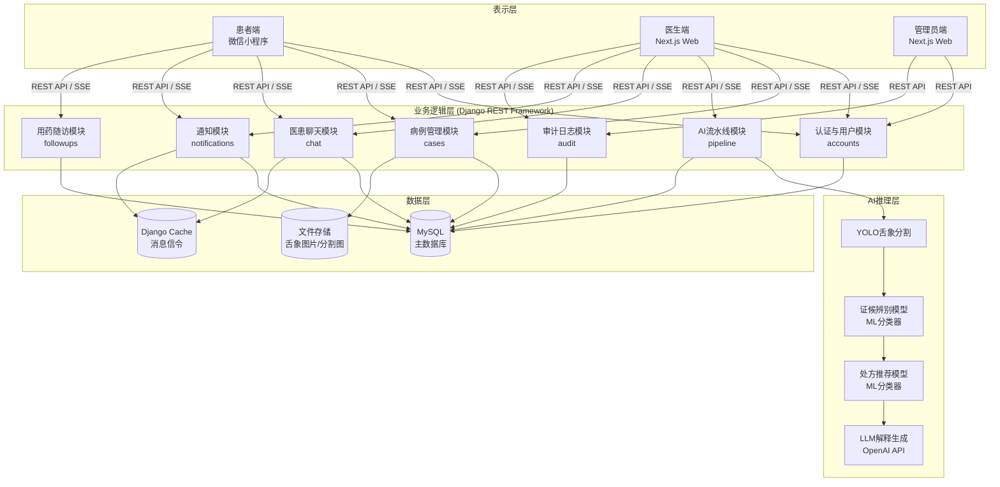
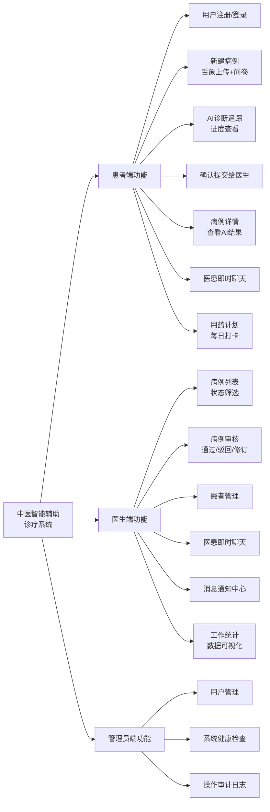

# 4.2 系统总体结构图

## 系统层次结构图



## 系统功能模块分解图


```
%%{init:{
  "theme":"base",
  "flowchart":{"curve":"basis","nodeSpacing":28,"rankSpacing":40},
  "themeVariables":{
    "fontFamily":"SimSun, Songti SC, Arial",
    "fontSize":"16px",
    "primaryTextColor":"#111827",
    "lineColor":"#6B7280"
  }
}}%%

flowchart LR
  SYS["中医智能辅助<br/>诊疗系统"]:::sys

  SYS --> P1["患者端功能"]:::hubP
  SYS --> D1["医生端功能"]:::hubD
  SYS --> A1["管理员端功能"]:::hubA

  %% 患者端
  subgraph P["患者端"]
    direction TB
    P11["用户注册/登录"]:::item
    P12["新建病例<br/>舌象上传+问卷"]:::item
    P13["AI诊断追踪<br/>进度查看"]:::item
    P14["确认提交给医生"]:::item
    P15["病例详情<br/>查看AI结果"]:::item
    P16["医患即时聊天"]:::item
    P17["用药计划<br/>每日打卡"]:::item
  end
  P1 --> P

  %% 医生端
  subgraph D["医生端"]
    direction TB
    D11["病例列表<br/>状态筛选"]:::item
    D12["病例审核<br/>通过/驳回/修订"]:::item
    D13["患者管理"]:::item
    D14["医患即时聊天"]:::item
    D15["消息通知中心"]:::item
    D16["工作统计<br/>数据可视化"]:::item
  end
  D1 --> D

  %% 管理员端
  subgraph A["管理员端"]
    direction TB
    A11["用户管理"]:::item
    A12["系统健康检查"]:::item
    A13["操作审计日志"]:::item
  end
  A1 --> A

  %% 节点样式
  classDef sys fill:#111827,stroke:#111827,color:#FFFFFF,stroke-width:2px,font-weight:bold;
  classDef hubP fill:#E0F2FE,stroke:#0284C7,stroke-width:2px,font-weight:bold;
  classDef hubD fill:#ECFDF5,stroke:#16A34A,stroke-width:2px,font-weight:bold;
  classDef hubA fill:#FFF7ED,stroke:#EA580C,stroke-width:2px,font-weight:bold;
  classDef item fill:#FFFFFF,stroke:#D1D5DB,stroke-width:1px,rx:10,ry:10;

  %% subgraph 外框样式（用 style 而不是 :::class，兼容性最好）
  style P fill:#F0F9FF,stroke:#BAE6FD,stroke-width:2px,stroke-dasharray: 3 3,rx:14,ry:14
  style D fill:#F0FDF4,stroke:#BBF7D0,stroke-width:2px,stroke-dasharray: 3 3,rx:14,ry:14
  style A fill:#FFF7ED,stroke:#FED7AA,stroke-width:2px,stroke-dasharray: 3 3,rx:14,ry:14
```