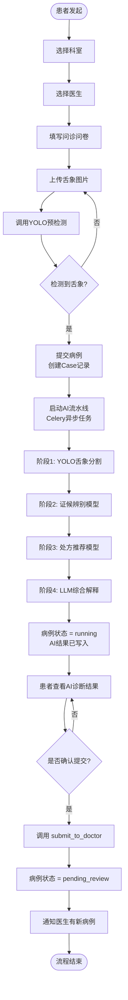
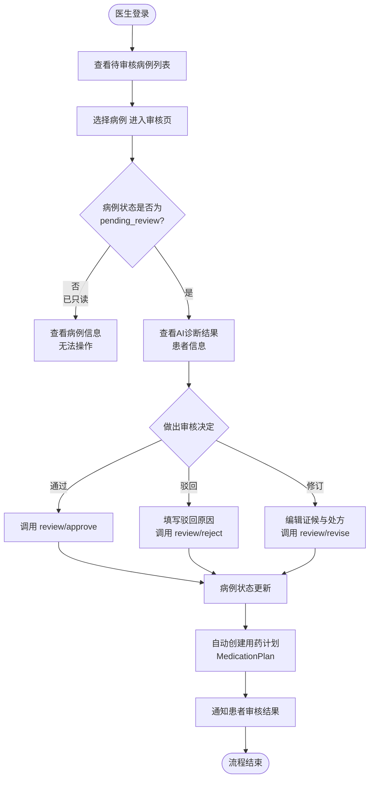
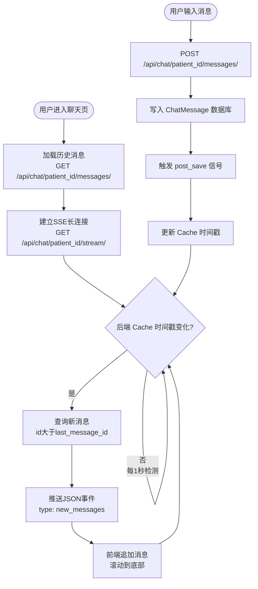
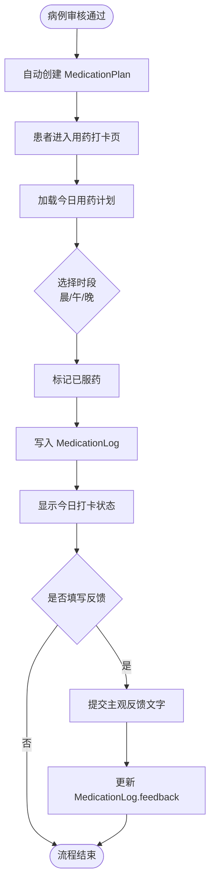
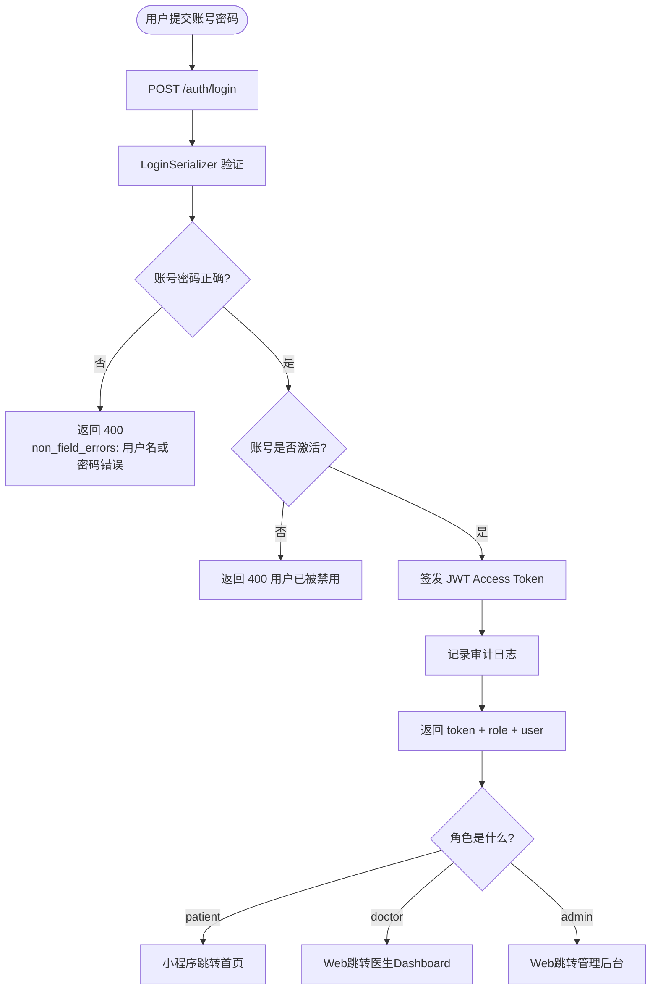

# 4.3 各功能模块流程图

## 4.3.1 患者新建病例与AI诊断流程

```mermaid
flowchart TD
    A([患者发起]) --> B[选择科室]
    B --> C[选择医生]
    C --> D[填写问诊问卷]
    D --> E[上传舌象图片]
    E --> F[调用YOLO预检测]
    F --> G{检测到舌象?}
    G -- 否 --> E
    G -- 是 --> H[提交病例\n创建Case记录]
    H --> I[启动AI流水线\nCelery异步任务]
    I --> J[阶段1: YOLO舌象分割]
    J --> K[阶段2: 证候辨别模型]
    K --> L[阶段3: 处方推荐模型]
    L --> M[阶段4: LLM综合解释]
    M --> N[病例状态 = running\nAI结果已写入]
    N --> O[患者查看AI诊断结果]
    O --> P{是否确认提交?}
    P -- 否 --> O
    P -- 是 --> Q[调用 submit_to_doctor]
    Q --> R[病例状态 = pending_review]
    R --> S[通知医生有新病例]
    S --> Z([流程结束])
```

## 4.3.2 医生审核病例流程

```mermaid
flowchart TD
    A([医生登录]) --> B[查看待审核病例列表]
    B --> C[选择病例 进入审核页]
    C --> D{病例状态是否为\npending_review?}
    D -- 否\n已只读 --> E[查看病例信息\n无法操作]
    D -- 是 --> F[查看AI诊断结果\n患者信息]
    F --> G{做出审核决定}
    G -- 通过 --> H[调用 review/approve]
    G -- 驳回 --> I[填写驳回原因\n调用 review/reject]
    G -- 修订 --> J[编辑证候与处方\n调用 review/revise]
    H & I & J --> K[病例状态更新]
    K --> L[自动创建用药计划\nMedicationPlan]
    L --> M[通知患者审核结果]
    M --> N([流程结束])
```

## 4.3.3 医患即时通讯流程

```mermaid
flowchart TD
    A([用户进入聊天页]) --> B[加载历史消息\nGET /api/chat/patient_id/messages/]
    B --> C[建立SSE长连接\nGET /api/chat/patient_id/stream/]
    C --> D{后端 Cache 时间戳变化?}
    D -- 否\n每1秒检测 --> D
    D -- 是 --> E[查询新消息\nid大于last_message_id]
    E --> F[推送JSON事件\ntype: new_messages]
    F --> G[前端追加消息\n滚动到底部]
    G --> D

    H([用户输入消息]) --> I[POST /api/chat/patient_id/messages/]
    I --> J[写入 ChatMessage 数据库]
    J --> K[触发 post_save 信号]
    K --> L[更新 Cache 时间戳]
    L --> D
```

## 4.3.4 用药随访打卡流程

```mermaid
flowchart TD
    A([病例审核通过]) --> B[自动创建 MedicationPlan]
    B --> C[患者进入用药打卡页]
    C --> D[加载今日用药计划]
    D --> E{选择时段\n晨/午/晚}
    E --> F[标记已服药]
    F --> G[写入 MedicationLog]
    G --> H[显示今日打卡状态]
    H --> I{是否填写反馈}
    I -- 是 --> J[提交主观反馈文字]
    J --> K[更新 MedicationLog.feedback]
    I -- 否 --> L([流程结束])
    K --> L
```

## 4.3.5 系统登录鉴权流程

```mermaid
flowchart TD
    A([用户提交账号密码]) --> B[POST /auth/login]
    B --> C[LoginSerializer 验证]
    C --> D{账号密码正确?}
    D -- 否 --> E[返回 400\nnon_field_errors: 用户名或密码错误]
    D -- 是 --> F{账号是否激活?}
    F -- 否 --> G[返回 400 用户已被禁用]
    F -- 是 --> H[签发 JWT Access Token]
    H --> I[记录审计日志]
    I --> J[返回 token + role + user]
    J --> K{角色是什么?}
    K -- patient --> L[小程序跳转首页]
    K -- doctor --> M[Web跳转医生Dashboard]
    K -- admin --> N[Web跳转管理后台]
```
