# 4.4.1 概念结构设计

## (1) 各实体 ER 图（含属性）

### 用户实体（User）

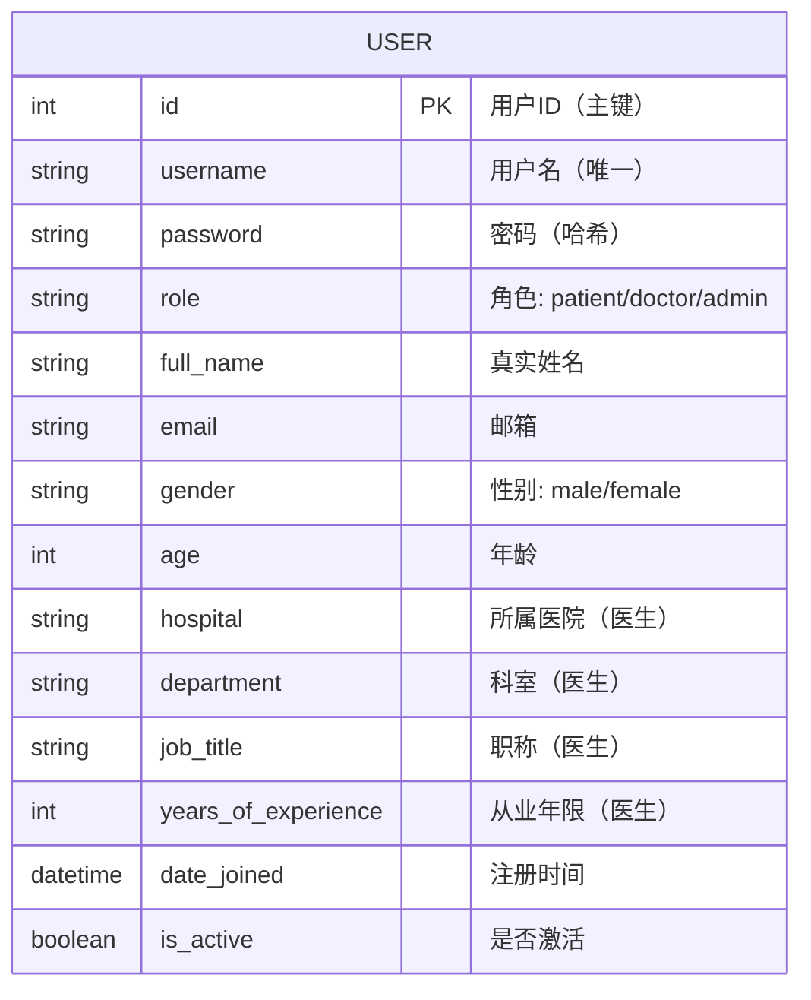

### 病例实体（Case）

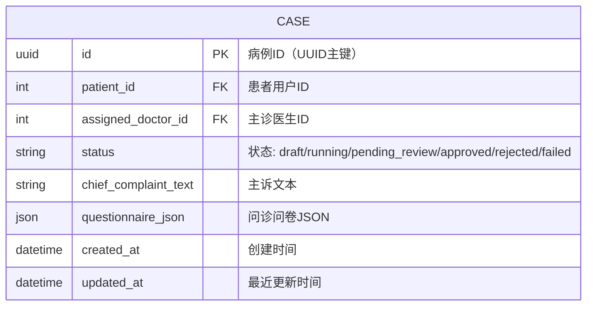

### 病例资源实体（CaseAsset）

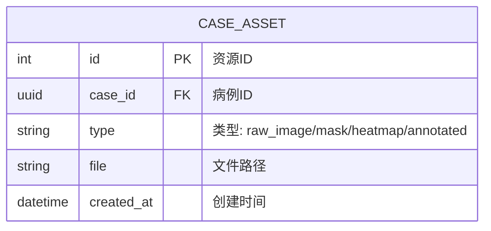

### 审核记录实体（Review）

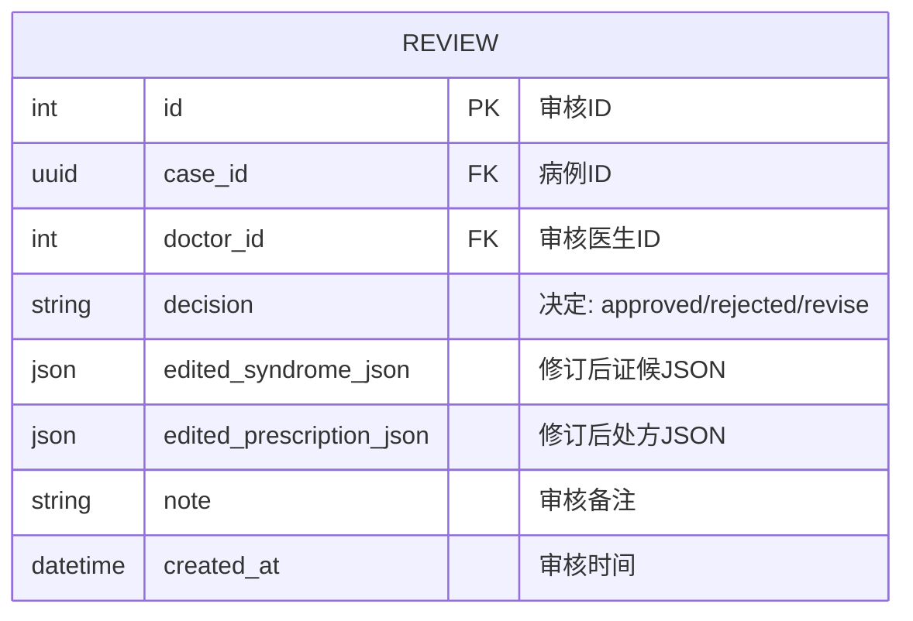

### AI流水线运行记录实体（PipelineRun）

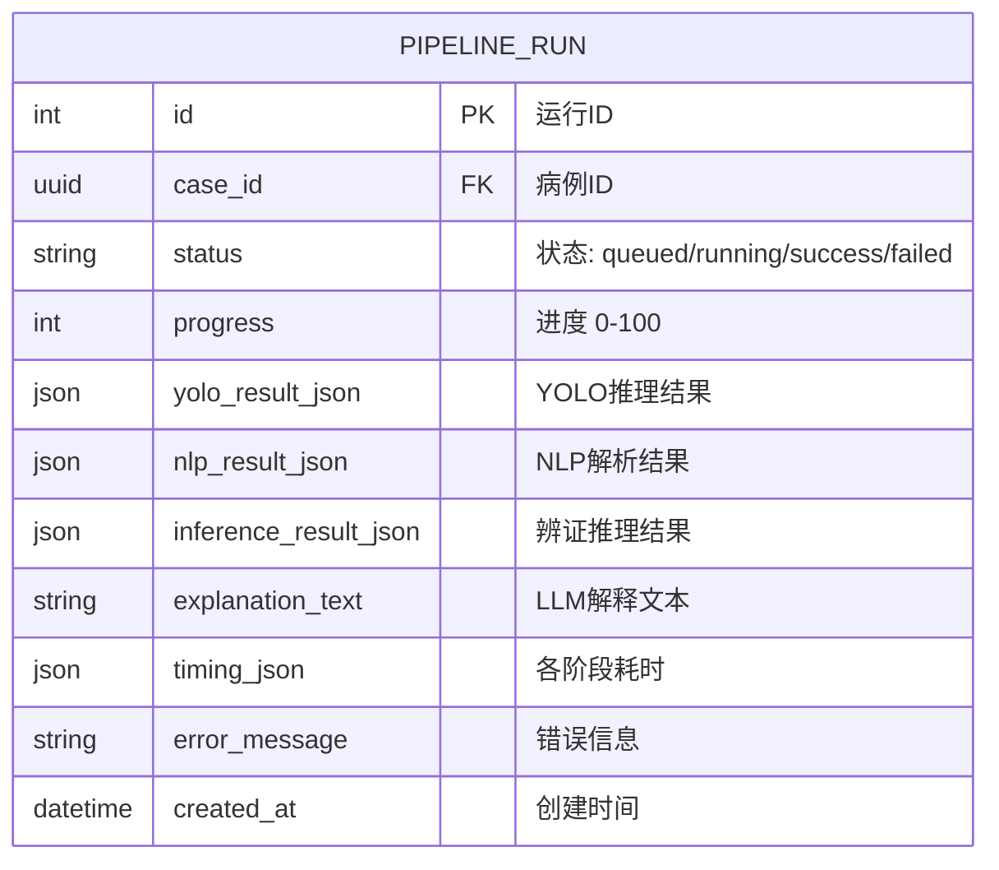

### 聊天消息实体（ChatMessage）

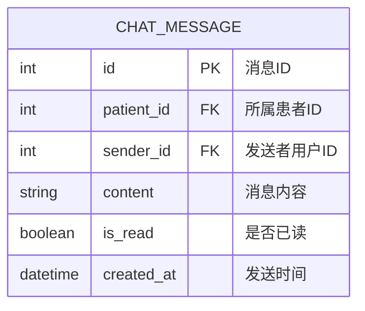

### 系统通知实体（Notification）

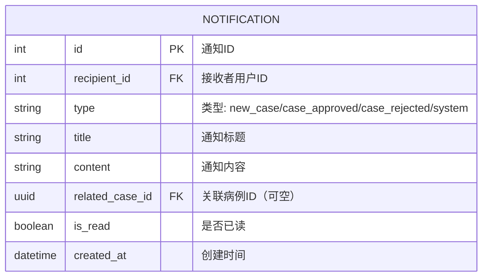

### 用药计划实体（MedicationPlan）

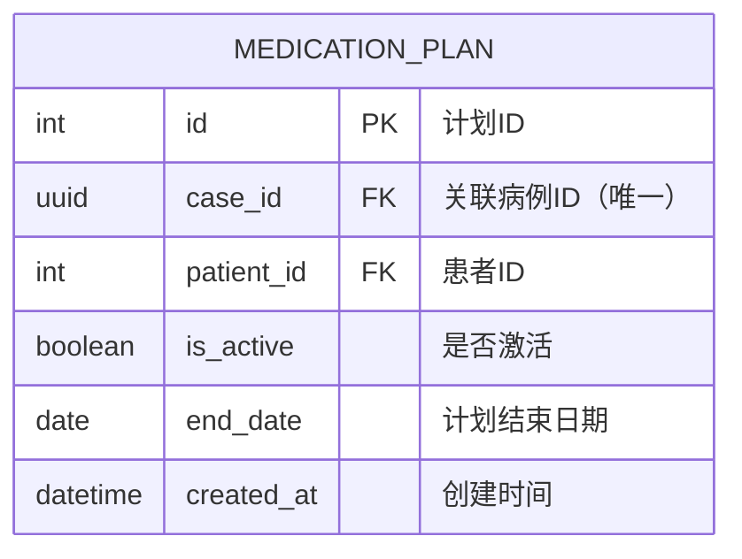

### 用药打卡记录实体（MedicationLog）

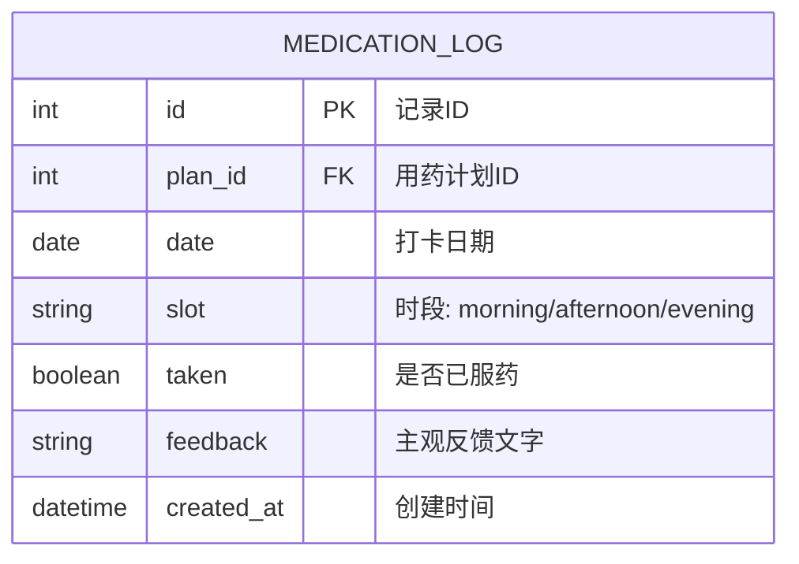

### 审计日志实体（AuditLog）

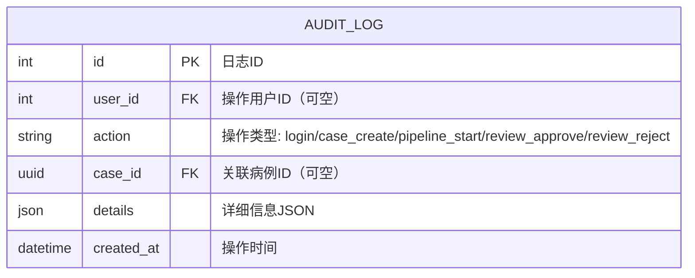

---

## (2) 全局 ER 图（不画实体属性）

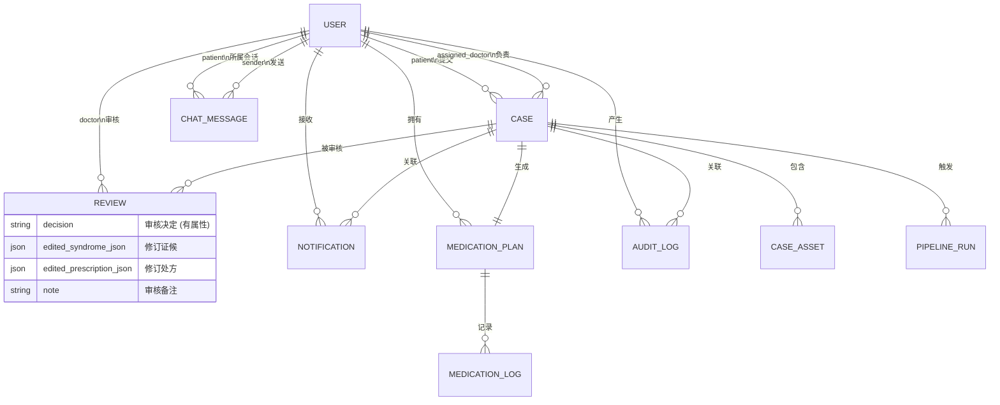
